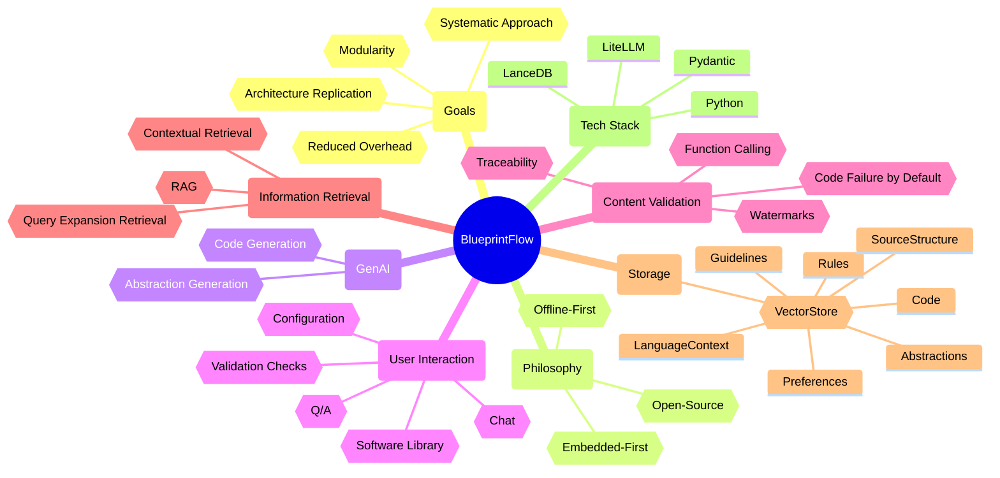

# Mind Map

```mermaid
mindmap
    ((BlueprintFlow))
        (Goals)
            {{Systematic Approach}}
            {{Architecture Replication}}
            {{Modularity}}
            {{Reduced Overhead}}
        (Philosophy)
            {{Offline-First}}
            {{Embedded-First}}
            {{Open-Source}}
        (GenAI)
            {{Code Generation}}
            {{Abstraction Generation}}
        (User Interaction)
            {{Q/A}}
            {{Chat}}
            {{Configuration}}
            {{Software Library}}
            {{Validation Checks}}
        (Content Validation)
            {{Code Failure by Default}}
            {{Function Calling}}
            {{Traceability}}
            {{Watermarks}}
        (Information Retrieval)
            {{RAG}}
            {{Contextual Retrieval}}
            {{Query Expansion Retrieval}}
        (Storage)
            {{VectorStore}}
                LanguageContext
                Preferences
                Rules
                Guidelines
                SourceStructure
                Abstractions
                Code
        (Tech Stack)
            Python
            LiteLLM
            Pydantic
            LanceDB
```
